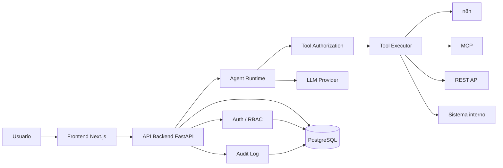

# Architecture

## Componentes

- `Frontend`: experiencia de chat y administración.
- `API Backend`: auth, RBAC, conversaciones, chat y admin.
- `Auth/RBAC`: valida usuario, organización y permisos antes de cada operación sensible.
- `Agent Runtime`: orquesta historial, tools y proveedor LLM.
- `Tool Executor`: ejecuta acciones permitidas en backend.
- `PostgreSQL`: persistencia multiempresa.
- `LLM Provider`: capa intercambiable para OpenAI, Anthropic, Google o modelos locales.
- `Audit Log`: trazabilidad de accesos, tools y errores.

